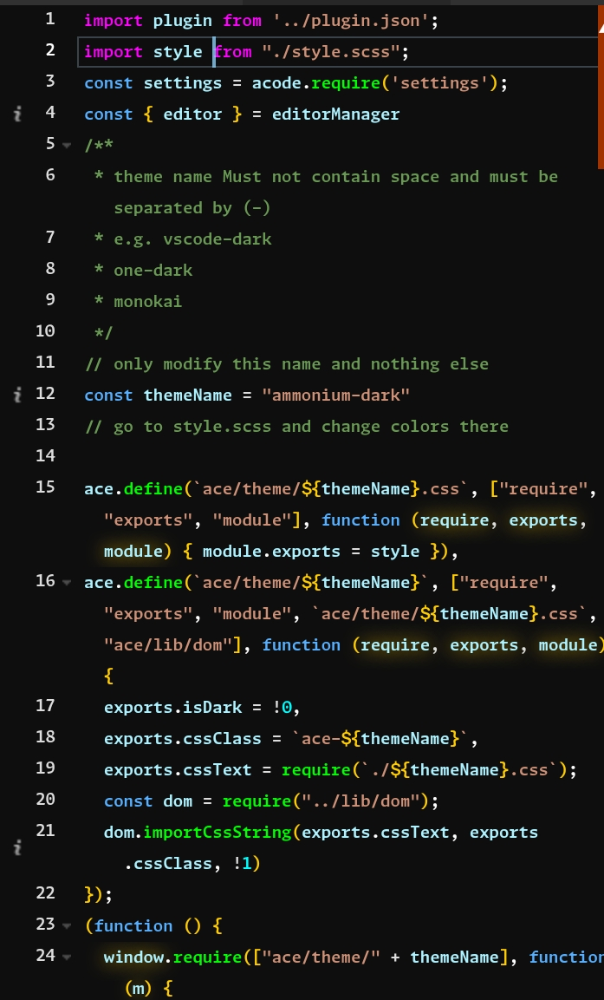

# RadiantEclipse Theme

RadiantEclipse is a unique and vibrant theme for code editors, designed to enhance your coding experience with its radiant colors and dark ambiance.

## Features

- Radiant neon colors for syntax highlighting
- Full dark background for reduced eye strain
- Unique and vibrant theme unlike any other
- Optimized for readability and aesthetics

## Screenshots

## Feedback

If you have any feedback, suggestions, or issues with the RadiantEclipse theme, please feel free to [open an issue](https://github.com/abrarishere/acode-radiant-eclipse-theme/issues) on GitHub.

## Credits

RadiantEclipse theme is created by Muhammad Abrar

